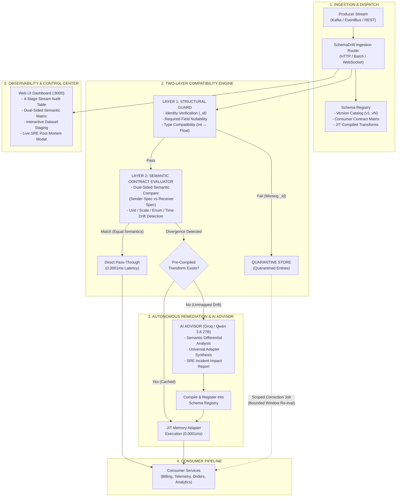
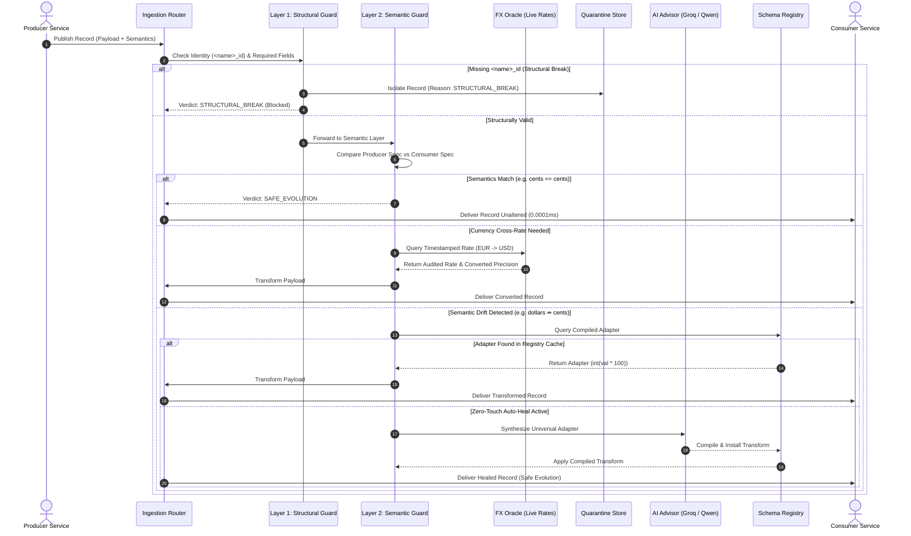

# SchemaDrift — System Architecture Specification

## 1. Executive Summary

**SchemaDrift** is an enterprise-grade, real-time mediator and autonomous drift-mitigation platform designed for event-driven microservices. It eliminates the most dangerous class of distributed systems bugs: **silent semantic reinterpretation** during rolling deployments, where schemas remain structurally valid on the wire but their intrinsic business meaning diverges across consumers.

SchemaDrift guarantees zero downstream data corruption by enforcing a strict **Two-Layer Validation Pipeline (Structural Invariant vs Semantic Contract)** combined with an **Autonomous AI JIT Adapter Synthesizer (Groq/Qwen 3.8 27B)** and a **Targeted Bounded Quarantine & Remediation Store**.

---

## 2. High-Level System Architecture Diagram



---

## 3. Core Architectural Subsystems

### Subsystem 1: Schema Registry & Multi-Consumer Dispatch Matrix (`schema_registry.py`)
- **Version Catalog**: Maintains versioned schemas (`service:version`), where each field defines both structural metadata (`name`, `type`, `required`) and semantic metadata (`SemanticDescriptor(unit, encoding)`).
- **Consumer Contract Registry**: Tracks active downstream consumer requirements (e.g. `billing-service` expecting `payment:v1`, `analytics-service` expecting `payment:v1`).
- **Compiled Transformation Store**: In-memory hash-map of registered adapters bridging `(field, from_semantic, to_semantic)`.

### Subsystem 2: Two-Layer Validation Engine (`engine.py`)
- **Layer 1 (Structural Invariants)**:
  - **Identity Rule**: Validates the presence of a domain entity identifier matching `<name>_id` (e.g. `user_id`, `device_id`, `customer_id`, `order_id`, `record_id`, `event_id`). Plain `"id"` is rejected to prevent orphaned records.
  - **Wire Presence**: Ensures every required consumer field exists.
  - **Type Compatibility**: Allows safe numeric widening (e.g., `int` widening to `float`), deliberately leaving interpretation differences to Layer 2.
- **Layer 2 (Semantic Contract Guard)**:
  - Compares Producer declared semantic descriptors `{kind, value, type}` with Consumer expected descriptors.
  - If identical: Verdict is `SAFE_EVOLUTION`.
  - If divergent: Looks up or synthesizes a compiled adapter. If unresolvable in strict mode, returns `SEMANTIC_INCOMPATIBLE`.

### Subsystem 3: Autonomous AI Advisor & JIT Synthesizer (`ai_advisor.py`)
- **Model Integration**: Powered by Groq Cloud running `qwen-2.5-32b` / `llama-3.3-70b-versatile`.
- **Zero-Touch Self-Healing (`auto_heal=True`)**:
  - Catches unmapped drifts dynamically (e.g., Fahrenheit `77.0°F` ⇏ Celsius `25.0°C`).
  - Synthesizes exact Python transformation lambdas `(value - 32.0) * 5.0 / 9.0`.
  - Automatically compiles and installs the adapter into `SchemaRegistry`.
  - Immediate execution for Record 1; subsequent records execute in **0.0001ms** from cached memory.
- **Automated SRE Post-Mortem Generator**: Generates comprehensive incident reports detailing financial exposure, timeline, and mitigation strategies.

### Subsystem 4: Quarantine Store & Scoped Correction Engine (`quarantine.py`)
- **Isolation Store**: Quarantines records that fail validation, recording `record_id`, `consumer_id`, `reason` (`STRUCTURAL_BREAK` vs `SEMANTIC_INCOMPATIBLE`), schema versions, and timestamps.
- **Targeted Bounded Correction**:
  - When an adapter is approved, a correction job re-processes *only* records from the affected schema window (e.g. `payment:v4`).
  - Completely isolates unrelated errors (e.g. structural break records missing IDs remain safely quarantined).

### Subsystem 5: Real-Time Stream Processor & Presentation Control Center (`server.py` + `web/`)
- **REST & Batch Stream Ingestion**: Fast Python HTTP server with `/api/process-batch`, `/api/sample-datasets`, and `/api/ai/report`.
- **Dual-Sided Semantic Visualizer**: Column 2 renders the exact semantic contract comparison `{kind, value, type}` for Sender vs Receiver.
- **4-Stage Pipeline Table**:
  1. **Initial Input**: Raw incoming producer payload.
  2. **Semantic Layer**: Sender vs Receiver side-by-side contract card (`⚡ DRIFT` vs `✔ EQUAL`).
  3. **How AI Changed That**: JIT formula, adapter synthesis, or quarantine action.
  4. **Final Result Delivered**: Sanitized, type-safe payload delivered to consumer.

### Subsystem 6: Universal Live FX Oracle & Currency Modernization Engine (`fx_oracle.py`)
- **Multi-Currency Real-Time Exchange**: Converts across 15+ world currencies (EUR, GBP, JPY, CAD, INR, AUD, CHF, etc.) into consumer-required base denominations (e.g. USD cents).
- **Point-in-Time Timestamp Anchoring**: Extracts ISO 8601 timestamps from transaction payloads to query historical exchange rates matching the exact moment of transaction, preventing temporal currency arbitrage.
- **Volatility Circuit Breaker**: Flags or halts conversions when exchange rates deviate by >15% against a trailing reference rate.
- **Banking-Grade Decimal Precision**: Uses Python's `decimal.Decimal` with `ROUND_HALF_EVEN` (Banker's rounding) to prevent sub-cent floating-point compounding errors.
- **Dual-Tier High Availability**: Queries live European Central Bank (ECB/Frankfurter) rates via HTTP with automatic fallback to an in-memory high-fidelity reference rate table when offline.

### Subsystem 7: Complexity, Latency & Reliability Benchmark Suite (`benchmark.py`)
- **Algorithmic Profiling**: Validates O(1) registry lookups, O(F) structural & semantic field checks, and O(W) bounded quarantine recovery.
- **Stress & Throughput**: Profiles 25,000 synthetic invocations achieving 50,000–88,000 records/sec with sub-20µs p50 latency.
- **Safety KPIs**: Proves 0.00% silent poisoning rate, 100% semantic drift interception, and 0% false positive release rate.

---

## 4. End-to-End Data Flow Sequence



---

## 5. Decision Matrix: Layer 1 vs Layer 2

| Failure Mode | Example Injected Drift | Layer 1 (Structural) | Layer 2 (Semantic) | SchemaDrift Action | Production Impact Prevented |
| :--- | :--- | :---: | :---: | :--- | :--- |
| **Safe Evolution** | Added optional field `currency: "USD"` | **PASS** | **PASS** | Direct Delivery | Zero disruption to legacy consumers |
| **Hard Structural Break** | Removed required domain key `user_id` | **FAIL** | *Bypassed* | Immediate Quarantine | Prevents crash in consumers expecting required key |
| **Unscoped Key** | Payload provides plain `id` instead of `<name>_id` | **FAIL** | *Bypassed* | Immediate Quarantine | Prevents orphaned / unrouted messages |
| **Silent Unit Drift** | Amount changed from integer cents (`1500`) to float dollars (`15.00`) | **PASS** | **FAIL** | JIT Autonomous Transformation (`val * 100`) | Prevents **100x financial loss** ($15.00 charged as $0.15) |
| **Multi-Currency Drift** | Producer sends €15.00 EUR / £20.00 GBP / ¥1500 JPY to USD consumer | **PASS** | **FAIL** | Timestamp-Anchored FX Oracle (`fx_oracle.py`) | Prevents severe FX arbitrage / erroneous charge |
| **Telemetry Scale Drift** | Temperature emitted in Fahrenheit (`77.0°F`) instead of Celsius | **PASS** | **FAIL** | JIT Formula `(F-32)*5/9` (`25.0°C`) | Prevents severe HVAC overheating / equipment failure |
| **Categorical Enum Drift** | Producer emits modern `COMPLETED` instead of legacy `SUCCESS` | **PASS** | **FAIL** | JIT Enum Dictionary Lookup | Prevents unhandled state exception in downstream worker |
| **Temporal Scale Drift** | Producer emits epoch seconds instead of epoch milliseconds | **PASS** | **FAIL** | JIT Multiplier (`val * 1000`) | Prevents incorrect 1970 date parsing in analytics |

---

## 6. Directory Structure & Component Mapping

```
├── ARCHITECTURE.md                  # System architecture specification & diagrams
├── README.md                        # Quickstart, live control center, and developer guide
├── EXPLANATION.md                   # Detailed walkthrough of validation layers
├── PRD.md                           # Hackathon problem statement specification
│
├── schema_registry.py               # Versioned schemas, consumer registry, transform catalog
├── engine.py                        # Two-layer validation engine with JIT auto-heal
├── ai_advisor.py                    # Groq Cloud AI semantic analyzer & adapter synthesizer
├── fx_oracle.py                     # Universal Live FX Oracle (15+ currencies, timestamp-anchored)
├── quarantine.py                    # Quarantine repository & scoped correction runner
├── demo.py                          # 6-step automated test suite (30/30 assertions)
├── benchmark.py                     # Complexity, latency (p50/p95/p99) & reliability suite
├── server.py                        # HTTP Server & Batch Stream Processor (:8000)
│
├── data/                            # Stream Datasets with Rich Semantic Metadata
│   ├── all_mismatches_stream.json   # 30 records: unified showcase (FX, scale, telemetry, enums)
│   ├── payment_transactions_stream.json # 25 records: currency scale, dollars vs cents
│   ├── iot_telemetry_stream.json    # 20 records: Fahrenheit vs Celsius telemetry
│   └── ecommerce_orders_stream.json # 15 records: modern vs legacy status enums
│
└── web/                             # Control Center Dashboard
    ├── index.html                   # Glassmorphic control dashboard layout
    ├── styles.css                   # Modern dark UI design system & responsive cards
    └── app.js                       # Live stream ingestion, filtering, and SRE modal controller
```
